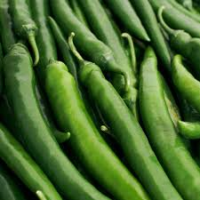

<html>
<head>
  <meta charset="UTF-8">
  <title>서면나눔5일장</title>
  <meta name="description" content="양양군 서면의 장터, 서면나눔5일장 농산물 직거래 페이지입니다.">
  <meta name="viewport" content="width=device-width, initial-scale=1.0">
  <link href="https://unpkg.com/tailwindcss@^2/dist/tailwind.min.css" rel="stylesheet">
  
</head>
<body class="font-sans text-gray-800 bg-gray-50">

<!-- Header -->
<header class="bg-white shadow-sm">
  

    

      
5일

      

        <h1 class="text-lg font-semibold">서면나눔5일장</h1>
        
양양군 서면 구룡령로 1906-89

      

    

    

      <input id="search-input" type="text" placeholder="검색..." class="border p-2 rounded w-64">
      <nav class="space-x-4 text-sm">
        <a href="#schedule" class="hover:underline">장터 일정</a>
        <a href="#donation" class="hover:underline">기부금 사용내역</a>
        <a href="#posts" class="hover:underline">게시글</a>
        <a href="#products" class="hover:underline">상품</a>
        <button id="login-btn" class="px-2 py-1 bg-blue-600 text-white rounded">관리자 로그인</button>
      </nav>
    

  

</header>

<!-- Hero Section -->
<section class="hero-bg py-12">
  

    

      <h2 class="text-3xl font-extrabold mb-2">맛있는 고추를 저희 장터에서 사세요!🌶</h2>
      

        <a href="#schedule" class="px-4 py-2 bg-red-500 text-white rounded shadow-sm">장터 일정 보기</a>
        <a href="https://forms.gle/h7DNUtKJ9b5EeR3CA" target="_blank" class="px-4 py-2 border border-gray-300 rounded hover:bg-gray-100">문의 작성하기</a>
        <a href="tel:01026946608" class="px-4 py-2 border border-gray-300 rounded hover:bg-gray-100">전화 문의</a>
      

    

    

      
      
홍고추

      
0원

      
무료배송 (CJ ONE)

    

  

</section>

<!-- Schedule Section (항상 보임) -->
<section id="schedule" class="bg-white py-8">
  

    <h3 class="text-2xl font-bold mb-4">장터 일정</h3>
    
본 장터는 5일 간격으로 운영됩니다.

    

      <table class="min-w-full text-sm text-left">
        <thead>
          <tr class="text-gray-600">
            <th class="p-2">날짜</th>
            <th class="p-2">판매 품목</th>
          </tr>
        </thead>
        <tbody>
          <tr class="border-t">
            <td class="p-2">매달 4일, 9일</td>
            <td class="p-2">생고추, 건고추, 풋고추</td>
          </tr>
          <tr class="border-t bg-white">
            <td class="p-2">매달 14일, 19일</td>
            <td class="p-2">생고추, 건고추, 풋고추</td>
          </tr>
          <tr class="border-t bg-white">
            <td class="p-2">매달 24일, 29일</td>
            <td class="p-2">생고추, 건고추, 풋고추</td>
          </tr>
        </tbody>
      </table>
    

  

</section>

<!-- Donation Section -->
<section id="donation" class="bg-white py-10">
  

    <h3 class="text-2xl font-bold mb-4">기부금 사용내역</h3>
    
서면나눔5일장은 기부금을 투명하게 운영하며, 매달 사용 내역을 공개합니다.

    

      <table class="min-w-full text-sm text-left">
        <thead>
          <tr class="text-gray-600">
            <th class="p-2">날짜</th>
            <th class="p-2">항목</th>
            <th class="p-2">금액</th>
            <th class="p-2">비고</th>
          </tr>
        </thead>
        <tbody id="donation-body"></tbody>
      </table>
    

    
※ 개인 비용으로 구매한 농산물은 투자 비율만큼 가져간 후 일부 기부, 일부 소유합니다.

  

</section>

<!-- Posts Section -->
<section id="posts" class="bg-white py-10">
  

    <h3 class="text-2xl font-bold mb-4">게시글</h3>
    

      <input id="post-title" type="text" placeholder="제목" class="border p-2 w-full mb-2 rounded">
      <textarea id="post-content" placeholder="내용" class="border p-2 w-full mb-2 rounded"></textarea>
      <button id="post-submit" class="px-4 py-2 bg-green-600 text-white rounded">게시</button>
    

    

      

        <h4 class="font-semibold">2025년 9월 20일 장터 준비 안내</h4>
        
이번 주 장터는 홍고추와 풋고추를 중심으로 진행됩니다.

      

    

  

</section>

<!-- Products Section -->
<section id="products" class="bg-white py-10">
  

    <h3 class="text-2xl font-bold mb-4">상품</h3>
    

      

        
        
홍고추

        
0원

      

      

        
        
풋고추

        
0원

      

    

    
※ 고추 1kg 기준: 100g당 300원, 건고추 가격은 별도 문의.

  

</section>

<!-- Footer -->
<footer class="bg-gray-800 text-gray-200 py-6 mt-8">
  

    

      
서면나눔5일장

      
주소: 양양군 서면 구룡령로 1906-89

      
※ 고추 1kg 기준: 100g당 300원, 건고추 가격은 별도 문의.

    

    

      
© 2025 서면나눔5일장. All rights reserved.

    

  

</footer>

<!-- 관리자 로그인 모달 -->

  

    <h3 class="text-lg font-bold mb-4">관리자 로그인</h3>
    <input id="admin-id" type="text" placeholder="ID" class="border p-2 w-full mb-2 rounded">
    <input id="admin-pw" type="password" placeholder="비밀번호" class="border p-2 w-full mb-4 rounded">
    

      <button id="login-cancel" class="px-3 py-1 bg-gray-400 text-white rounded">취소</button>
      <button id="login-confirm" class="px-3 py-1 bg-blue-600 text-white rounded">로그인</button>
    

  

<!-- JS -->

</body>
</html>
